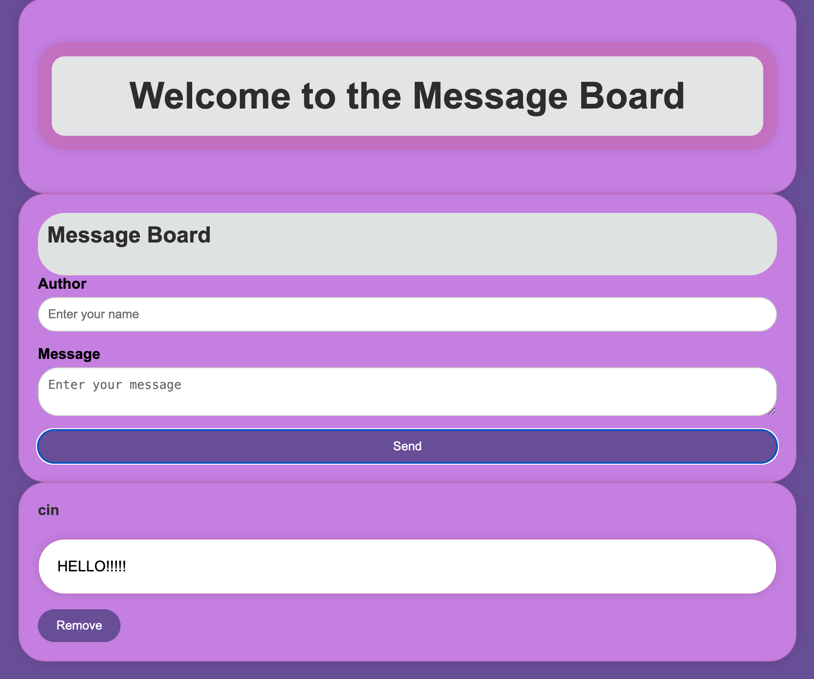
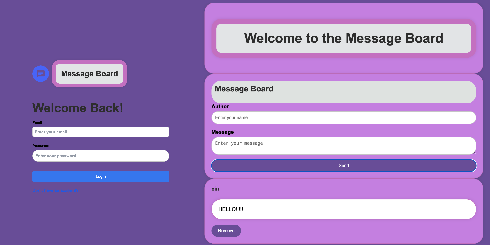

# Social Network API
## Description
MessageBored is a simple message board application built with a React frontend and an Express/Apollo Server backend. Users can post messages, which are stored in a MongoDB database, and view the list of posted messages!

## Technologies Used
- Frontend: React, Apollo Client, Vite
- Backend: Express, Apollo Server, MongoDB, GraphQL
- Database: MongoDB

## Installation
To access the project content:
   ```
    1. Use this link to the project repo
    https://github.com/Jesse2919/messagebored
   ```
    2. Use comand git clone to clone the repo
   ```
    3. Install dependencies using npm install in the server and client directories
   ```
    4. Set up MongoDB
   ```
    5. Start the server and frontend using npm run dev
```
## Usage




## Contributors
[Jesse Corona](https://github.com/Jesse2919)

[Jackson Phanvilay](https://github.com/JPhanvilay)

[Guillermo Saenz](https://github.com/GuillerSaenz)

[Cinthya Vazquez](https://github.com/cinvqz)

[Anthony](https://github.com/anthonyjj)
## Credits

[How to write a GOOD README File](https://www.freecodecamp.org/news/how-to-write-a-good-readme-file/)

[Xpert Learning Assistant](https://bootcampspot.instructure.com/courses/5281/external_tools/313)

[Chat GPT](https://chatgpt.com/)

Matteo Ramazzini